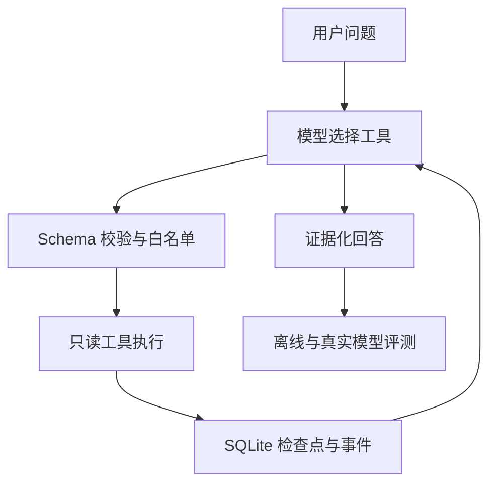

# AgentHarness Lab · InsightOps Demo

一个面向多工具 Agent 的小型运行时：负责让模型调用工具、保存状态、失败恢复、记录轨迹并执行评测。支付事故调查只是用来证明运行时能力的业务 Demo，不是产品反馈管理平台。


## 它解决什么问题

大模型会生成文字，但一个可运行的 Agent 还需要外层程序处理工具参数、超时、重试、执行预算、进程中断和效果评测。本项目实现的就是这层 **Agent Harness**。

用户询问“3.2.1 发布后支付失败投诉为什么增加”，模型可自主选择只读统计与文档检索工具；Harness 验证参数、执行工具、把结果送回模型并保存全过程。若进程或 API 失败，任务会暂停并可从 SQLite 检查点恢复。



## 已实现并验证

| 能力 | 实现 | 验证状态 |
|---|---|---|
| 多轮 Agent Loop | 模型响应 → 工具调用 → 工具结果回传 → 最终回答 | DeepSeek 真实 API 已跑通 |
| Provider 适配 | DeepSeek Chat Completions；OpenAI Responses API | DeepSeek 已真实验证；OpenAI 仅模拟 HTTP 契约测试 |
| 工具安全 | 白名单、Pydantic 严格参数、拒绝额外字段、结果长度限制 | 自动测试 |
| 可恢复执行 | SQLite checkpoint、暂停/恢复、未完成工具调用续跑 | 自动测试 |
| 并发安全 | 单 run 租约、心跳续约、过期接管、旧 worker 禁止写入 | 自动测试 |
| 可靠性控制 | 模型/工具重试、超时、轮次和工具调用预算 | 自动测试 |
| 可观测性 | 事件轨迹、参数、结果、错误、模型延迟和 Token 用量 | 自动测试 + 真实报告 |
| 答案保护 | 发布前检查明显的数字子集矛盾，可要求模型重写 | 自动测试 |
| Evals | 4条确定性离线回归 + 20条 DeepSeek 真实场景 | 已执行并保留报告 |

当前共有 **44 条 Pytest 用例通过**。

## 真实评测结果

最终 DeepSeek 报告使用20条项目自建案例，覆盖正常调查、单工具问题、因果陷阱、数据范围外拒答、错误前提、Prompt Injection 和越权请求。这不是公开 Benchmark，也不代表生产环境准确率。

| 指标 | 最终复核结果 |
|---|---:|
| 运行完成率 | 20/20（100%） |
| 工具执行成功率 | 20/20（100%） |
| 工具选择符合预期 | 19/20（95%） |
| 关键事实命中 | 19/20（95%） |
| 拒答/因果边界 | 20/20（100%） |
| 数字一致性 | 20/20（100%） |
| 严格整题通过 | 19/20（95%） |
| 模型调用总耗时 | 49.99 秒 |
| 平均模型调用耗时/案例 | 2.50 秒 |
| 总 Token | 31,173 |
| 平均 Token/案例 | 1,558.65 |

一次最终 API 原始报告经最新规则离线复算得到19/20；没有重新生成答案。复核规则接受“因果关系尚不能确认”等等价表达，也允许“依据明确工具边界直接拒答”和“检索相关文档后拒答”两种合理路径。唯一保留的真实失败是 `causal_trap`：模型没有先检索文档，并错误声称文档中不存在 SDK 5.8.0。模型输出存在随机性，因此该结果只代表已保存的这次运行，不承诺每次都稳定为19/20。

完整分析见 [DeepSeek 基线与故障分析](docs/EVAL_BASELINE_ANALYSIS.md)。

## 快速开始

支持 Python 3.10+。在项目根目录执行：

```powershell
conda activate insightops
python -m pip install -r requirements.txt
python -m pytest -q
python -m uvicorn backend.app.main:app --reload
```

打开 <http://127.0.0.1:8000>。默认 `demo` 模式使用确定性脚本模型，不需要密钥；它会真实执行本地工具和 Harness，但不是大模型。

主要接口：

- `POST /api/harness/runs`：创建任务；
- `GET /api/harness/runs/{run_id}`：读取检查点状态；
- `GET /api/harness/runs/{run_id}/events`：查看执行轨迹；
- `POST /api/harness/runs/{run_id}/resume`：恢复暂停任务；
- `GET /api/harness/evals`：运行4条离线回归。

## 真实 DeepSeek 评测

密钥只放在本机环境变量，不写入源码：

```powershell
$deepseekKey = (Get-Clipboard -Raw).Trim()
$env:DEEPSEEK_API_KEY = $deepseekKey
python -m backend.app.harness.smoke_deepseek
python -m backend.app.harness.eval_deepseek --output .\evals\results\deepseek_final.json
Remove-Item Env:DEEPSEEK_API_KEY
$deepseekKey = $null
Set-Clipboard -Value " "
```

对已有报告使用最新确定性规则重新评分，不产生 API 费用：

```powershell
python -m backend.app.harness.eval_deepseek `
  --rescore .\evals\results\deepseek_final.json `
  --output .\evals\results\deepseek_final_rescored.json
```

只要存在失败案例，评测命令就返回退出码1，这是给 CI 使用的预期行为，不代表程序崩溃。

## 代码结构

```text
backend/app/harness/
  model.py           Provider 适配与离线脚本模型
  runtime.py         Agent Loop、预算、重试与答案发布
  tools.py           工具契约、白名单与参数校验
  store.py           SQLite 检查点、事件与租约
  grounding.py       确定性数字一致性检查
  eval.py            4条离线回归
  eval_deepseek.py   20条真实评测、报告与离线复算
evals/
  harness_cases.json
  deepseek_cases.json
tests/
frontend/
docs/
```

## 设计边界

- 工具只读且数据为模拟数据；项目证明的是运行时工程方法，不是企业事故结论。
- 文档检索是关键词检索，不是向量数据库。
- 工具调用当前逐个执行，未实现并行工具调度。
- `asyncio.to_thread` 超时无法终止底层线程，因此带副作用的真实工具仍需幂等键和外部隔离。
- 尚未实现 SSE、MCP、Sandbox、HITL、多 Agent 和长期记忆；README 不把它们写成已有能力。
- 当前没有用户鉴权、数据保留策略和生产级脱敏，不能直接部署为企业生产服务。

## 进一步阅读

- [用人话理解这个项目](docs/PROJECT_EXPLAINED.md)
- [真实模型评测说明](docs/REAL_MODEL_EVAL.md)
- [基线、误判与真实失败](docs/EVAL_BASELINE_ANALYSIS.md)
- [面试讲述稿](docs/INTERVIEW_PITCH.md)
- [简历项目表述](docs/RESUME_BULLETS.md)
