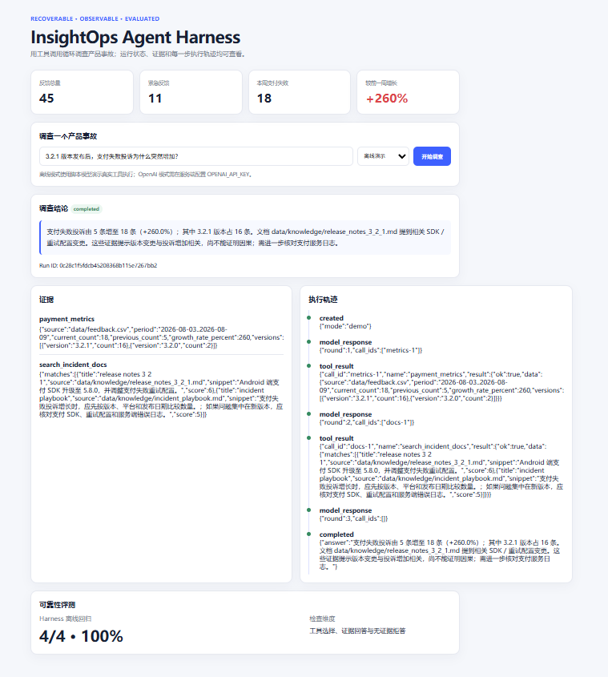
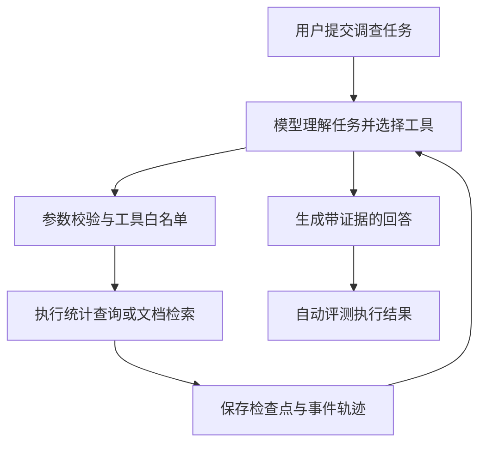

# InsightOps Agent Harness

**一个负责让多工具 Agent 稳定运行、失败后能够恢复，并且可以被完整检查和评测的后端运行系统。**

它不是普通聊天机器人，也不是用户反馈管理平台。大模型负责理解任务、选择工具和组织答案；InsightOps Agent Harness 负责模型外面的执行工作：校验工具参数、调用工具、限制执行次数、处理超时和重试、保存任务进度、记录完整轨迹，并用自动评测检查 Agent 的行为。

项目使用“支付失败投诉突然增加”作为演示任务：用户提出调查问题后，模型会自主选择统计查询和产品文档检索工具，系统执行工具并把结果交还模型，最终生成带数据依据和不确定性说明的调查结论。这个业务场景只是用来验证运行系统，不是项目本身的边界。



## 谁会使用它

- **Agent 研发工程师**：接入模型和工具，运行多轮 Function Calling，并处理任务失败与恢复。
- **AI 应用后端工程师**：通过 FastAPI 创建任务、读取状态和执行轨迹，把 Agent 能力接入业务系统。
- **测试开发与 Agent 评测工程师**：构造正常、异常和安全场景，检查工具选择、事实、数字、拒答和恢复行为。

## 一次任务如何运行



以“3.2.1 发布后支付失败投诉为什么增加”为例：

1. FastAPI 接收任务并创建 `run_id`；
2. DeepSeek 或离线脚本模型判断需要哪些工具；
3. Harness 使用 Pydantic 校验工具名称和参数；
4. 运行只读统计与文档检索工具，并记录参数、结果、耗时和错误；
5. 每一轮状态写入 SQLite，进程或模型调用失败时任务暂停；
6. 恢复请求从最近检查点继续，而不是从头重复执行；
7. 模型根据工具证据生成结论，系统再执行数字一致性检查；
8. 评测程序检查工具选择、关键事实、拒答边界和最终答案。

## 核心能力

| 能力 | 项目中的实现 | 验证方式 |
|---|---|---|
| 多轮 Agent Loop | 模型响应 → 工具调用 → 结果回传 → 继续推理 → 最终回答 | DeepSeek 真实 API |
| 模型适配 | DeepSeek Chat Completions、OpenAI Responses API | DeepSeek 端到端；OpenAI HTTP 契约测试 |
| 工具调用 | 工具注册、白名单、Pydantic 严格参数校验、结果长度限制 | 自动化测试 |
| 可恢复执行 | SQLite Checkpoint、暂停/恢复、未完成调用续跑 | 故障恢复测试 |
| 并发控制 | 单任务租约、心跳续约、过期接管、旧 Worker 写入隔离 | 多 Worker 测试 |
| 可靠性控制 | 模型与工具重试、超时、轮次预算和工具调用预算 | 故障注入测试 |
| 可观测性 | 事件轨迹、工具参数与结果、异常、模型延迟、Token 用量 | 自动化测试与真实报告 |
| 答案校验 | 发布前检查明显的数字包含关系矛盾，触发模型重写 | 回归测试 |
| Agent Evals | 4 条确定性离线回归 + 20 条 DeepSeek 真实场景 | 已保存评测报告 |

当前项目共有 **44 条 Pytest 自动化测试通过**。

## 真实模型评测

项目使用 20 条自建场景测试 DeepSeek，覆盖完整调查、单工具查询、因果陷阱、超出数据范围、错误前提、Prompt Injection 和越权请求。这组数据用于验证当前系统的回归行为，不冒充公开 Benchmark。

| 指标 | 保存报告的复核结果 |
|---|---:|
| 运行完成率 | 20/20（100%） |
| 工具执行成功率 | 20/20（100%） |
| 工具选择符合预期 | 19/20（95%） |
| 关键事实命中 | 19/20（95%） |
| 拒答与因果边界 | 20/20（100%） |
| 数字一致性 | 20/20（100%） |
| 严格整题通过 | 19/20（95%） |
| 平均模型调用耗时/案例 | 2.50 秒 |
| 平均 Token/案例 | 1,558.65 |

最终原始 API 报告使用最新确定性规则离线复算后为 **19/20**。评测规则接受语义等价表达，唯一保留的失败案例是 `causal_trap`。完整过程见 [DeepSeek 基线与故障分析](docs/EVAL_BASELINE_ANALYSIS.md)。

## 快速开始

支持 Python 3.10+。在项目根目录执行：

```powershell
conda activate insightops
python -m pip install -r requirements.txt
python -m pytest -q
python -m uvicorn backend.app.main:app --reload
```

打开 `http://127.0.0.1:8000`。默认 `demo` 模式使用确定性脚本模型，不需要 API Key；它会真实运行 Harness 和本地工具，适合演示与回归测试。

主要接口：

- `POST /api/harness/runs`：创建任务；
- `GET /api/harness/runs/{run_id}`：读取任务状态；
- `GET /api/harness/runs/{run_id}/events`：读取执行轨迹；
- `POST /api/harness/runs/{run_id}/resume`：恢复暂停任务；
- `GET /api/harness/evals`：运行离线场景评测。

## 使用 DeepSeek 运行真实模型

API Key 只放在本机环境变量中，不写入源码：

```powershell
$deepseekKey = (Get-Clipboard -Raw).Trim()
$env:DEEPSEEK_API_KEY = $deepseekKey

python -m backend.app.harness.smoke_deepseek
python -m backend.app.harness.eval_deepseek --output .\evals\results\deepseek_final.json

Remove-Item Env:DEEPSEEK_API_KEY
$deepseekKey = $null
Set-Clipboard -Value " "
```

对已有报告重新评分不会调用 API，也不会产生费用：

```powershell
python -m backend.app.harness.eval_deepseek `
  --rescore .\evals\results\deepseek_final.json `
  --output .\evals\results\deepseek_final_rescored.json
```

只要存在失败案例，评测命令就返回退出码 1，便于 CI 判断回归是否通过。

## 代码结构

```text
backend/app/harness/
  model.py           模型接口适配与离线脚本模型
  runtime.py         Agent Loop、执行预算、重试与答案发布
  tools.py           工具注册、白名单与参数校验
  store.py           SQLite 检查点、事件轨迹与任务租约
  grounding.py       确定性数字一致性检查
  eval.py            4 条离线场景评测
  eval_deepseek.py   20 条真实模型评测、报告与离线复算
backend/app/main.py  FastAPI 接口与演示页面
evals/               评测数据与保存的结果
tests/               自动化测试
frontend/            演示界面
docs/                架构与评测说明
```

## 公开文档

- [架构说明](docs/ARCHITECTURE.md)
- [真实模型评测说明](docs/REAL_MODEL_EVAL.md)
- [基线、误判与真实失败分析](docs/EVAL_BASELINE_ANALYSIS.md)
- [DeepSeek 配置说明](docs/DEEPSEEK_SETUP.md)

## 项目范围

演示工具均为只读操作，使用模拟反馈数据和本地产品文档。项目重点是 Agent 的运行、恢复、观测和评测机制，不对模拟业务数据作真实企业结论。
