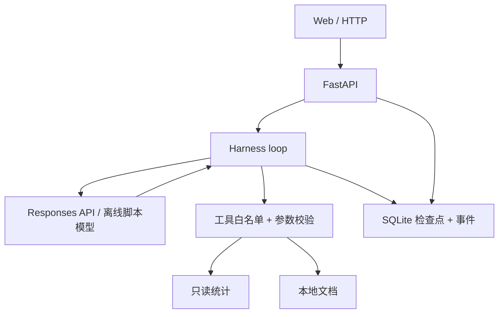

# InsightOps Harness 架构

## 状态流

`ready → running → completed`；模型失败进入 `paused`，可调用恢复接口；超过调用预算进入 `limit_reached`，不会自动继续。每轮模型输出在工具执行前保存，工具输出与事件在一笔数据库事务中保存。恢复时扫描未取得 `function_call_output` 的调用，因此已保存的工具结果不会再次执行。恢复前须取得 SQLite 租约；正在执行时第二个处理者收到 409，失去租约的旧处理者不能写入检查点。后台每隔租约时长的三分之一续约。当前只读工具允许崩溃窗口内安全重试；涉及写操作时需另加外部幂等键。

## 为什么手工维护会话

`store=false` 的 Responses 请求每轮包含用户输入、之前的模型输出和对应的工具结果。这样运行时可独立保存输入与检查点并在进程重启后恢复。模型推理项若存在，也随 `response.output` 原样保留在会话中。为了控制本地演示的规模，设置模型轮数、工具调用次数、单次工具输出与单轮模型输出上限。

## 适用范围

这里实现了模型调用循环、工具合同、状态恢复、SQLite 租约、事件轨迹与小规模离线回归。多 worker 的租约争用已通过独立 Store 实例的并发测试；尚未完成真实多进程压力验证。未实现 MCP 服务器、容器沙箱、审批节点、向量索引或线上质量数据。由于工具只读，也没有必要为了演示凭空增加 shell 权限。真实 API 模式需要在有密钥的环境完成端到端核验。

旧版 `backend/app/agent.py` 是规则路由，供 `/api/investigate` 和原有 12 条场景评测对照；不要把旧版 11/12 与新版本 4/4 合并成一个指标。
